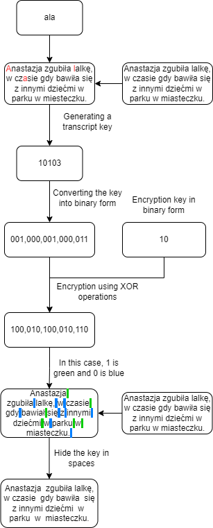
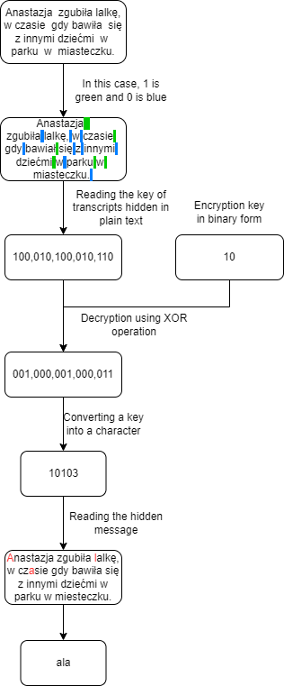

# steanogram

It is a program on written using python language version 3.12.0, which is used to hide information in text form in other text and it is operated from the console.

## Instructions for use

After starting the program, it has the option to choose a mode from between:
* creating transcripts 
* reading them
* exiting the program

> [!IMPORTANT]
> All text files must be in the **"ROBOCZY"** folder.

When we enter the mode of creating transcripts, the program will ask for the information we want to hide. It must not have any spaces, as the program does not encode them, in addition, it should not contain capital letters, and each character in it must have at least one equivalent in the plain text. Next, the program will ask you to provide the name of the file with the plain text, this file must be located in the "WORK" folder otherwise the program will not be able to find it. The text in this file must have a minimum of as many words as there are characters in the secret information, but it is advisable that it be several or even several times larger, depending on the type of characters in the text to be encrypted. Next, the program asks you to specify the file in which the plaintext will be saved along with the shorthand key, this file should be in the folder "ROBOCZY" be empty, because the program is adding information to the file, so everything that was previously in this file after this operation will remain there. In the absence of such a file, the program will create it itself. At the end, the program asks for the encryption key to encrypt the shorthand key, the password must not contain any characters other than digits.

If you choose the option to read a previously hidden message, the program will ask you to provide the name of the file with the text in which our information is hidden, as in the previous case it must be in the "ROBOCZY" folder. After which the program will ask you to provide the encryption key, with which we encrypted the key, as before it does not have to consist only of digits. Finally, the program will display the secret information.

## Diagram of operation

 

## Principle of operation

The mechanism I used to hide the secret text is to divide it into individual characters, then match the subsequent symbols thus obtained from the characters in the subsequent words of the open text. If in a given word there is a character of interest, then in the key of the shorthand we write its position in the word, if it is not there then we add zero to the key. After encoding all the secret information in this way, we convert the resulting key from decimal to binary form, where each position of each character is encoded on three bits, from which it follows that in each word the letter we inserter can be found at the seventh position at most. We then encrypt the shorthand key, modified in this way, using the encryption key of our choice with the XOR function, after which we write the result of this operation in the spaces of the plaintext file. In the case where there are more zeros than ones in the shorthand key, we use the basic notation: a one is two spaces, a zero is one space, and in the case of being behind an enters sign (in Word, the end-of-paragraph sign), a one is one space, a zero is no space. On the other hand, if there are more ones, we use the reverse notation, that is: one is one space, zero is two spaces, and in the case of being behind the entera sign, one is no space, zero is one space. This mechanism is designed to minimize the probability of detecting a key.

The process of reading the hidden information involves reading, the shorthand key from the spaces in the text. Then it decrypts it using the encryption key used earlier for encryption, and converts it back into decimal form. Finally, it reconstructs the secret information based on the key thus obtained.
